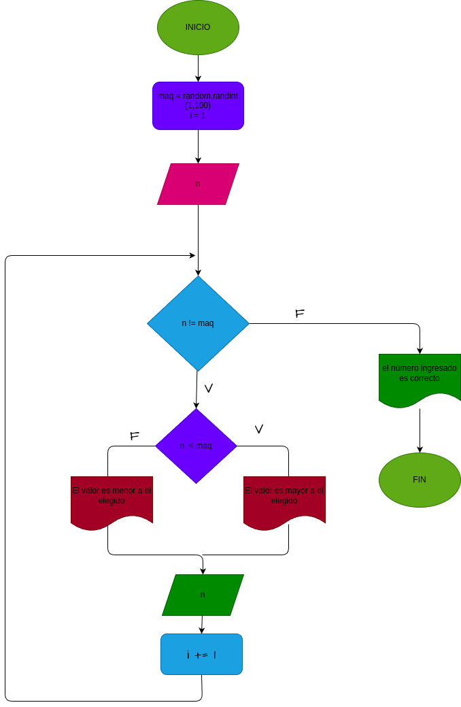

# Adivina_el_n-mero
Este es un simple juego en el que el usuario debe adivinar un número aleatorio generado por la computadora. El juego proporciona pistas para guiar al usuario hasta que logre adivinar el número correctamente.

## input

### Variables de entrada
n: número que desea ingresar
### prosesisng
maq: La computadora genera un número aleatorio entre 1 y 100.

i: lleva el control de la cantidad de intentos del usuario

mientras n < maq:

Si el número ingresado es menor que el número generado, el programa indica que el número a adivinar es mayor.

Si el número ingresado es mayor que el número generado, el programa indica que el número a adivinar es menor.

volver a pedir un valor y suma 1 intento

### output
Depende el resultado sera la respuesta
# Diseño

 
# Construcción
